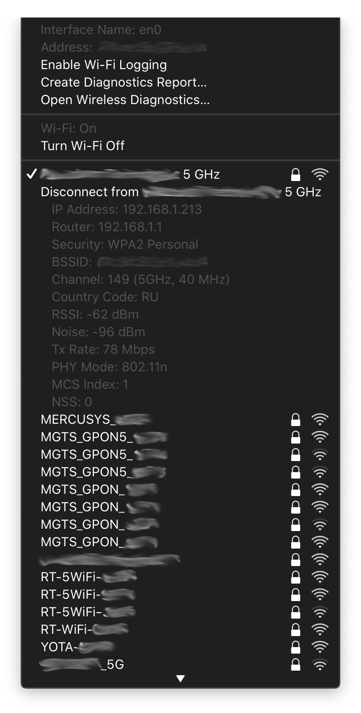
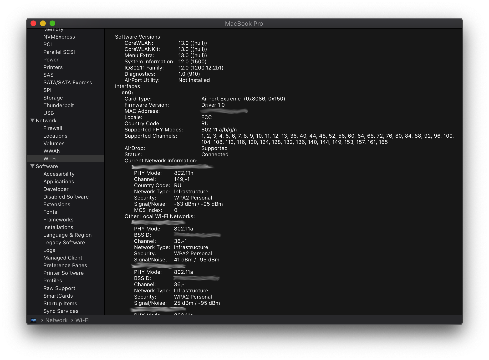
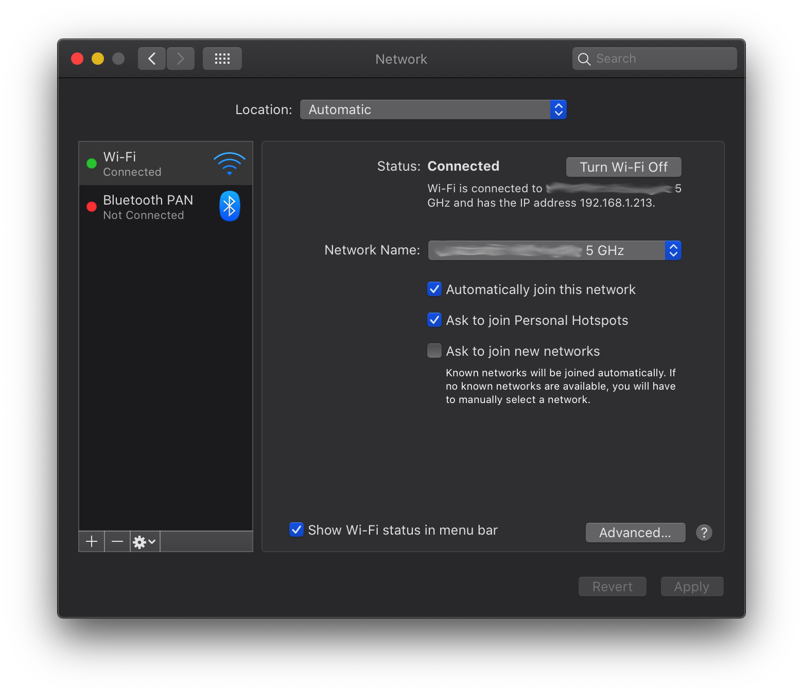
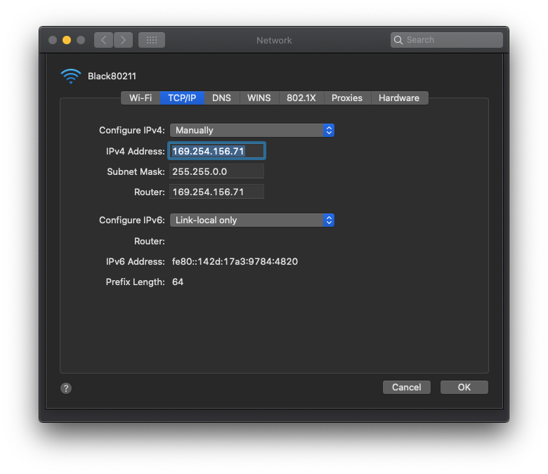
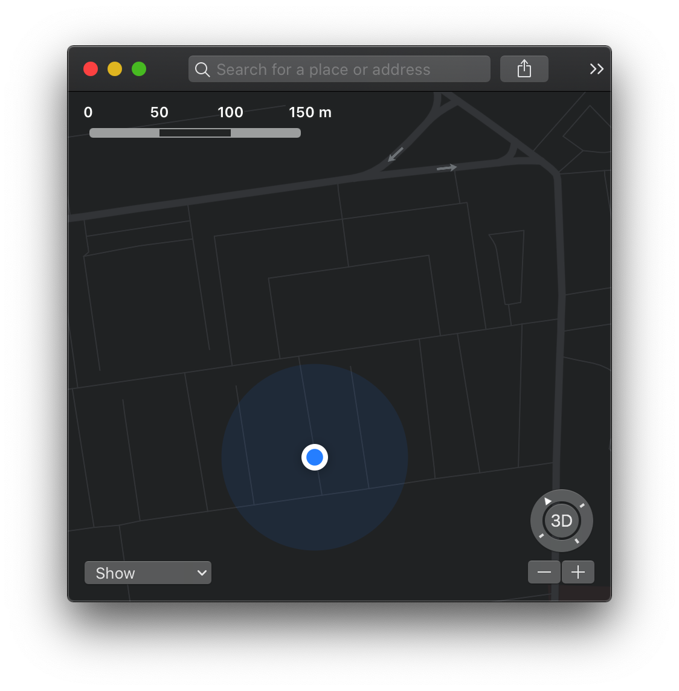

Archived: now the development is continued directly in https://github.com/OpenIntelWireless/itlwm

This project joins https://github.com/AppleIntelWifi/Black80211-Catalina and https://github.com/OpenIntelWireless/itlwm to provide a wireless driver for Intel adapters that can be controlled using native  menu item.

 

The driver is recognized by the system as a Wi-Fi adapter, not an Ethernet adapter:







The following actions already work:
- Turning Wi-Fi off and on
- Scanning networks (this also allows Location Services to detect location)



- Connecting to Open, WEP Open System, WPA2 Personal and WPA2 Enterprise networks

The following authentication types are not supported:
- WEP Shared Key
- WPA3
- OWE

The following has not been tested:
- First-generation WPA Personal and WPA Enterprise

itlwm should be used from https://github.com/usr-sse2/itlwm

macOS Catalina and Big Sur are supported.

### How to load manually:
put Black80211.kext and itlwm.kext in the same folder
```bash
sudo chown -R root:wheel *.kext
sudo chmod -R 755 *.kext
sudo kextutil itlwm.kext
sudo kextutil Black80211.kext
```

### How to load on boot:
- *(Recommended)* the kexts can be injected with this OpenCore 0.6.1. **[SecureBoot](https://dortania.github.io/OpenCore-Post-Install/universal/security/applesecureboot.html) should be enabled** to load the `immutablekernel` which always contains IO80211Family.kext;
- *(Not recommended)* the kexts can be installed to `/Library/Extensions` with System Integrity Protection disabled;
- only in the installer or Recovery the kexts can be injected with regular OpenCore or Clover, because macOS excludes IO80211Family from the `prelinkedkernel` when there are no wireless devices with drivers in system locations.
